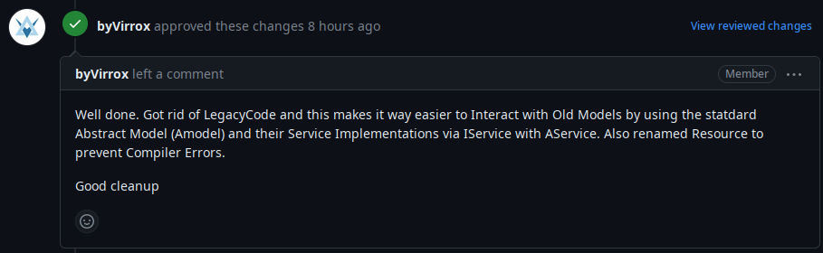

# Project work 3

## Issue description

This week, I worked on a comprehensive refactoring and quality improvement of the codebase.
This was tracked in [issue #175](https://github.com/Software-Engineering-Red/MAUI-APP/issues/175),
implemented by [PR #177](https://github.com/Software-Engineering-Red/MAUI-APP/pull/177).

The refactoring aimed to reduce code duplication, to make the code conform to the naming guidelines
and to improve readability. This was a big task, 78 files were changed in the Pull Request.

A typical model file is shown below with the changes applied to it on Figure 1 and 2, before and after.
It is worth noting that the amount of code is more than halved.


```csharp
using SQLite;
using System.ComponentModel;
using System.Runtime.CompilerServices;

namespace UndacApp.Models {
    [Table("it_system_status")]
    public class ITSystemStatus : INotifyPropertyChanged
    {
        /// <summary>
        /// Unique primary key ID.
        /// </summary>
        [PrimaryKey, AutoIncrement]
        public int ID { get; set; }

        /// <summary>
        /// Name Stored private for ITStatus. 
        /// </summary>
        private string name;

        /// <summary>
        /// The Public getter and setter. 
        /// </summary>
        public string Name
        {
            get => name;
            set => SetField(ref name, value);
        }

        /// <summary>
        /// status stored for ITStatus
        /// </summary>
        public string status;
        /// <summary>
        /// The Public getter and setter for status. 
        /// </summary>
        public string Status
        {
            get => status;
            set => SetField(ref status, value);
        }
        /// <summary>
        /// avaliable stored for ITStatus
        /// </summary>
        public bool avaliable;
        /// <summary>
        /// The Public getter and setter for avaliable. 
        /// </summary>
        public bool Avaliable
        {
            get => avaliable;
            set => SetField(ref avaliable, value);
        }

        /// <summary>
        /// Event handling PropertyChange.
        /// </summary>
        public event PropertyChangedEventHandler? PropertyChanged;

        protected void OnPropertyChanged(string propertyName) =>
            PropertyChanged?.Invoke(this, new PropertyChangedEventArgs(propertyName));

        protected bool SetField<T>(ref T field, T value, [CallerMemberName] string propertyName = "")
        {
            if (EqualityComparer<T>.Default.Equals(field, value)) return false;
            field = value;
            OnPropertyChanged(propertyName);
            return true;
        }
    }

}
```
*Figure 1: old model file*

```csharp
using SQLite;

namespace UndacApp.Models {
    [Table("it_system_status")]
    public class ITSystemStatus : AModel
    {

        /// <summary>
        /// status stored for ITStatus
        /// </summary>
        public string status;

        /// <summary>
        /// The Public getter and setter for status. 
        /// </summary>
        public string Status
        {
            get => status;
            set => SetField(ref status, value);
        }

        /// <summary>
        /// avaliable stored for ITStatus
        /// </summary>
        public bool avaliable;

        /// <summary>
        /// The Public getter and setter for avaliable. 
        /// </summary>
        public bool Avaliable
        {
            get => avaliable;
            set => SetField(ref avaliable, value);
        }
    }

}
```

*Figure 2: new model file*

Similarly, all services were converted to use `AService<T>` and `IService<T>`,
which eliminated the need for custom service methods in almost all services.
A comparison of before and after are shown below on Figure 3 and 4.

```csharp
using UndacApp.Data;
using UndacApp.Models;
using SQLite;

namespace UndacApp.Services
{
    /// <summary>
    /// Service for managing skills using SQLite database.
    /// </summary>
    public class SkillService : ISkillService
    {
        private SQLiteAsyncConnection _dbConnection;

        /// <summary>
        /// Sets up the database connection and creates the Skill table if it doesn't exist.
        /// </summary>
        private async Task SetUpDb()
        {
            if (_dbConnection != null)
                return;

            _dbConnection = new SQLiteAsyncConnection(DatabaseSettings.DBPath, DatabaseSettings.Flags);
            await _dbConnection.CreateTableAsync<Skill>();
        }

        /// <summary>
        /// Adds a new skill to the database.
        /// </summary>
        /// <param name="skill">The skill to add.</param>
        /// <returns>The number of rows affected.</returns>
        public async Task<int> AddSkill(Skill skill)
        {
            await SetUpDb();
            return await _dbConnection.InsertAsync(skill);
        }

        /// <summary>
        /// Deletes a skill from the database.
        /// </summary>
        /// <param name="skill">The skill to delete.</param>
        /// <returns>The number of rows affected.</returns>
        public async Task<int> DeleteSkill(Skill skill)
        {
            await SetUpDb();
            return await _dbConnection.DeleteAsync(skill);
        }

        /// <summary>
        /// Retrieves a list of all skills from the database.
        /// </summary>
        /// <returns>A list of skills.</returns>
        public async Task<List<Skill>> GetSkillList()
        {
            await SetUpDb();
            return await _dbConnection.Table<Skill>().ToListAsync();
        }

        /// <summary>
        /// Updates an existing skill in the database.
        /// </summary>
        /// <param name="skill">The skill to update.</param>
        /// <returns>The number of rows affected.</returns>
        public async Task<int> UpdateSkill(Skill skill)
        {
            await SetUpDb();
            return await _dbConnection.UpdateAsync(skill);
        }
    }
}
```

*Figure 3: old service file*

```csharp
using UndacApp.Models;

namespace UndacApp.Services
{
    /// <summary>
    /// Service for managing skills using SQLite database.
    /// </summary>
    public class SkillService : AService<Skill>, ISkillService
    {

    }
}
```

*Figure 4: new service file*

## Code reviews

### My reviews of others' code

I have reviewed a PR earlier and requested the PR to be updated to the latest develop commit.
However, at the time of writing this report, the pull request appears to have disappeared without trace.

The new PR which I have reviewed the second time is [PR #182](https://github.com/Software-Engineering-Red/MAUI-APP/pull/182).
I have requested two changes here.
The first problem was that the model they have used included a duplicate `Name` field, which `AModel` already provides.
The second problem was a violation of the Single Responsibility Principle - a UI handler method
had password checking logic built-in.
By the time of merging, the new feedback has not been addressed.


### Reviews of my code

I have received two comments on my Pull Request ([PR #177](https://github.com/Software-Engineering-Red/MAUI-APP/pull/177)).
The comments did not request any changes to my code, so it was merged without changes.

The first review is shown on Figure 5.


The other comment was simply "Looks good."


## Reflection

*NOTE: This week's portfolio is written retrospectively together with Week 11 due to the author having COVID.
It is split into two on a thematic basis, but the reflection chronologically applies to both Week 10 and 11.*

While being ill during week 10 and week 11, I was checking the team's Discord server but there has been radio silence.
Teamwork has effectively disappeared in those two weeks. Reviews seem to be handled by people working with their pair,
but there has been zero discussion on a team level. My pair has disappeared, so I am soliciting people individually to get my code reviewed,
which is a very suboptimal way of teamwork.
I have tried reaching out with various questions but team engagement is next to non-existent.

Also, the `master` branch has become effectively abandoned, with everyone treating `develop` as the main branch.
This is disadvantageous because it disrupts the agreed-on workflow, and creates a maintainability problem for the codebase.

I have taken initiative and have done a major refactoring of the codebase. I have removed most of the duplicated code,
which should make the line count much smaller and should make the project much more maintainable.
When planning the refactor, I have proactively reached out to the whole team to notify them about my plan and to ask if anyone had any objections or concerns.
There have been zero comments by the deadline I set, so I have moved forward with the task as planned.

This week, I have improved in working under pressure, which includes working in the absence of any feedback or human interaction.
While it is not teamwork, it has been a useful experience in developing initiative and learning to handle isolation.

Looking at other people's pull requests, it seems that the practice of creating artificial issues continues,
in addition to ignoring feedback on pull requests and merging them without addressing it.
This is negative because it prevents any professional development as the code review will not find any issues that the
code author has not been aware of, and it subverts teamwork by discouraging people from giving meaningful feedback
and a proper code review.

Overall, the teamwork in the team project has deteriorated to an extent that there is no teamwork to speak of anymore.
From my part, I am trying to keep standards up and to find people who could be partners in this.
My aim is to encourage the usage of team channels (Discord server) for communication instead of one-to-one direct messages
to improve teamwork and to make knowledge sharing happen. For example, I have been trying to use the Discord server first to
find someone for code review, instead of just messaging someone.
