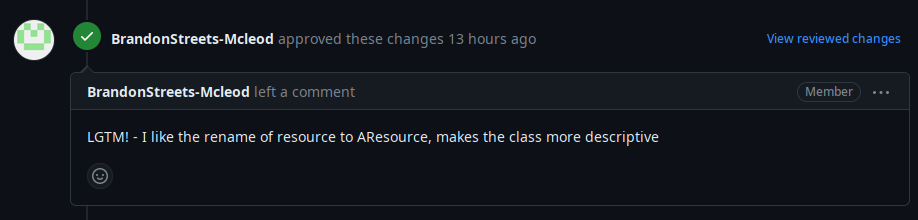

# Project work 4

## Issue description

Since we have ran out of issues to do by Week 10, this week I have worked on copying the Week 9 issue list into the repository
and implementing one issue from those.

I have resolved the long-standing issue of `master` being severely outdated. The `master` branch has been unmaintained for weeks,
and it hasn't been kept up to date with `develop` at all. I have merged `develop` into `master`.
This was not straightforward as the two branches have diverged due to people occasionally targeting `master` with pull requests instead of `develop`,
so there were quite a few merge conflicts.

I have also implemented [issue #154](https://github.com/Software-Engineering-Red/MAUI-APP/issues/154) this week
with [PR #178](https://github.com/Software-Engineering-Red/MAUI-APP/pull/178),
which was about providing an interface in the application to create and manage methodological documentation
for the UNDAC mission.

The model for the methodological documentation uses the new `AModel` class to eliminate code duplication (Figure 1).

```csharp
namespace UndacApp.Models {
    public class MethodologicalDocumentation : AModel
    {
        private DateTime? createdAt;
        public DateTime? CreatedAt
        {
            get => createdAt;
            set => SetField(ref createdAt, value);
        }

        private DateTime? lastModifiedAt;
        public DateTime? LastModifiedAt
        {
            get => lastModifiedAt;
            set => SetField(ref lastModifiedAt, value);
        }

        private string? author;
        public string? Author
        {
            get => author;
            set => SetField(ref author, value);
        }

        private string? contents;
        public string? Contents
        {
            get => contents;
            set => SetField(ref contents, value);
        }
    }

}
```

*Figure 1: MethodologicalDocumentation model class* 


## Code reviews

### Reviews of my code

The review I got for my pull request was positive. The review is shown on Figure 2.



*Figure 2: Code review for my pull request*

It did not contain any actionable feedback, so I have merged the pull request without changes.


### My reviews of others' code
I have reviewed [Pull Request #142](https://github.com/Software-Engineering-Red/MAUI-APP/pull/142).
That code still uses the old model/service framework, so in my review, I have requested it to be based on `AModel<T>` and `AService<T>`
to reduce code duplication.
The issue appears to be stalled for now, my comments have not been addressed yet and it hasn't been merged yet.


## Reflection

*NOTE: This week's portfolio is written together with Week 10 due to the author having COVID.
It is split into two on a thematic basis, but the reflection chronologically applies to both Week 10 and 11.*

While being ill during week 10 and week 11, I was checking the team's Discord server but there has been radio silence.
Teamwork has effectively disappeared in those two weeks. Reviews seem to be handled by people working with their pair,
but there has been zero discussion on a team level. My pair has disappeared, so I am soliciting people individually to get my code reviewed,
which is a very suboptimal way of teamwork.
I have tried reaching out with various questions but team engagement is next to non-existent.

This week, I have undertaken the fairly large task of updating `master` to the `develop` changes.
This was not trivial due to the divergence between `master` and `develop`. This was a useful experience for me
as I have gained skills in merging branches on the command line and using Git from the terminal more effectively.
I have also read about various Git commands and familiarised myself a bit with vi.

I have also discovered a bug in the C# compiler where it confused two classes - `UndacApp.Resource` and `UndacApp.Models.Resource`,
which made an interface not compile due to the compiler thinking the generic parameter had the wrong type.
This probably happens because `UndacApp.Resource` is an auto-generated class of the application's resources and
.NET does not take namespaces into account properly.

In order to fix this, I had to rename the `Resource` model to `AResource` to make the project compile.

These things have improved my software engineering practice due to learning my tools better,
which makes me a more efficient software engineer.

I have also been proactive in importing issues from the SET09102 repository, because
I have observed that there were barely any open and unassigned issues to do.
Furthermore, I also reached out to people asking them to follow the workflow more closely, so
we can avoid merge issues in the future.


In terms of possible improvements, it would be beneficial to disable the ability on GitHub to merge a pull request
ithout addressing the reviewers' comments. It would also be great if the team would follow the agreed-on
workflow and engage with the other team members and the team project. The code itself also has no tests,
so a unit test suite would be a significant improvement.

Overall, I am going to continue being proactive with contributing improvements to the team project and exemplifying a standard of quality to the team.
Also, if the team's social landscape allows it, I will spearhead efforts to improve processes, workflow and team engagement.