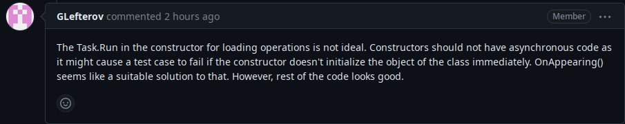

# Project work 4

## Issue description

This week, I have implemented four issues
([#152](https://github.com/Software-Engineering-Red/MAUI-APP/issues/152),
[#162](https://github.com/Software-Engineering-Red/MAUI-APP/issues/162),
[#163](https://github.com/Software-Engineering-Red/MAUI-APP/issues/163),
[#166](https://github.com/Software-Engineering-Red/MAUI-APP/issues/166))
in PR [#192](https://github.com/Software-Engineering-Red/MAUI-APP/pull/192).
Because these four issues relate to operations, I had to create an Operation model and the associated page.

The first issue was about being able to view the status of operations, the second issue was about being able to abort operations,
the third issue was about being able to write and view a final report of an operation
and the fourth issue was about being able to view the details of the currently ongoing operations.
The new Operation page is capable of all four functions.

One novel thing this week is that we use an enum for the operation status.

```csharp
public enum OperationStatus
{
    NotStarted,
    InProgress,
    Completed,
    Aborted
}
```

*Figure 1: OperationStatus enum*

This is saved and loaded by converting the enum to a string.

```csharp
// in the save method
var operation = new Operation()
{
    ...
    Status = Enum.Parse<OperationStatus>(StatusEntry.SelectedItem as string),
    ....
};

// in the method where the operation is loaded
StatusEntry.SelectedItem = selectedOperation.Status.ToString();
```

*Figure 2: Handling OperationStatus*


## Code reviews

### Reviews of my code

I have got two reviews for my pull request. One was "Looks good" as usual, but the other one was more detailed this time.
This second review is shown on Figure 3.



*Figure 3: Code review for my pull request*

To remedy this, I have moved the `LoadOperations` function from the constructor to `OnAppearing` as suggested by the reviewer.
This solves the problem of initialisation not necessarily being complete when the page is loaded if there is a delay with the database
since the code now waits for `LoadOperations` to finish entirely.

```diff
public OperationPage()
{
    InitializeComponent();
    this.BindingContext = new Operation();
    this.operationService = new OperationService();
+}
-   Task.Run(async () => await LoadOperations());
+protected override async void OnAppearing()
+{
+   await LoadOperations();
    NameEntry.Text = "";
    }
```

*Figure 4: Changes due to feedback on code review*

### My reviews of others' code
This week, I have reviewed three pull requests.

#### First

[Pull Request #188](https://github.com/Software-Engineering-Red/MAUI-APP/pull/188) converted the weather anomaly page into the MVVM pattern.
The code was well written, my only comment was that the ViewModel
should be refactored to be similar to AModel, with a common base class for `INotifyPropertyChanged` boilerplate.

#### Second
[Pull Request #190](https://github.com/Software-Engineering-Red/MAUI-APP/pull/190) added a User page to the application.
The biggest problem with the code was that `else if`'s were not used at all. Instead of those, nested `if`s were used,
which made the code *very* indented and hard to read. Furthermore, these methods were very long and had many responsibilities.
They should have been refactored into several, smaller methods and the `if`'s replaced with guard clauses.

#### Third
[Pull Request #191](https://github.com/Software-Engineering-Red/MAUI-APP/pull/191) re-implemented Equipment with support for associating equipment with Operations.
The code was good. My only issue with the PR was code duplication in one place. I have suggested it to be refactored into a separate method. I have raised this with the submitter who promptly
fixed the problem.


## Reflection

This week, I have noticed a severe gap in the application. Many completed issues and code references operations, but
no Operation entity actually existed yet. I have decided to remedy the issue and create a class to represent operations.
This also closed four issues (the ones referenced in the issue description) overall because those issues effectively require data to be stored on the operation and retrieved,
which was trivial to add once an Operation class existed.

A potential improvement would be updating all classes, which mainly use strings now, to have a reference to the operations.
In the user interface side, the operations could be input with a list picker, so only valid operations could be selected.

When I started working on my issue, I have made an error in my workflow. I have forgotten to create a branch before starting to work,
so my changes were against `develop` instead of my feature branch. This required me to get myself comfortable with the git `stash` feature.
After I created and checked the necessary feature branch out, I have applied the stash to my working tree.
This incident made me improve my workflow because it increased my knowledge of Git and Visual Studio.

I have thought about why this error happened, and I concluded that this problem was not caused by an issue with the workflow.
Instead, it was a one-off error caused by exhaustion due to sickness, and it is not possible to prevent this with workflow improvements.

### Summary
Overall, the team project was an interesting team exercise.
What worked well on this project is that the quality of code reviews have improved quite a lot. When this project was started,
most of the code reviews consisted of "LGTM" and simple approvals. However, in the end, most people have reviewed the pull requests in detail,
and the authors have acted on the feedback before merging them.
Also, this module was organised much better than the last module where we had teamwork. In this module, the module leader
conducted oversight over the projects, which helped the projects stay on track. The oversight also helped in facilitating team communication
by connecting team members and resolving ambiguities.

For personal improvement, I have developed code review skills and the ability to evaluate code from a maintainability perspective.
I have gained insight on the software development process, and learned what quality code looks like.
This module has made me realise that theory does not always translate to practice, and it is not trivial to implement
an agreed-on team workflow so everyone follows it. Sadly, the team did not manage to implement Scrum as it was discussed in the beginning.
Scrum would have probably helped with implementing the workflow in practice as someone would have had the responsibility and the power
to implement the workflow and ensure compliance by the team members.