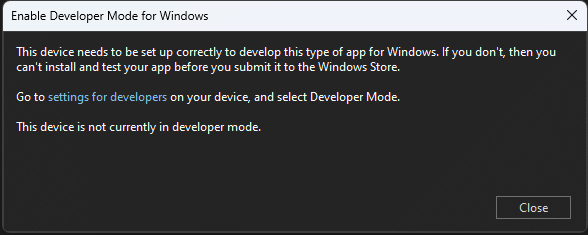

# Setup

## Initial teamwork

First, I set up a Discord server for the team.
I have created channels for assistance for those who are new to C#, Visual Studio or Git.

## Environment configuration

As a first step, we start by cloning our portfolio's repository (the one you are reading right now!).
I have chosen GitHub Desktop to manage my portfolio and I am using JetBrains Rider as a markdown editor.
It's a heavyweight tool but I am familiar with it.

Cloning is shown on Fig.1.
After logging into my GitHub account, I selected the repository and a suitable path to clone it to.

|      |
|:--------------------------------------------:|
| **Fig.1 - GitHub Desktop cloning interface** |

After setup, the interface looks like this.

|  |
|:------------------------------------------:|
| **Fig.2 - GitHub Desktop main interface**  |

The next step is installing MAUI.
Since I already had Visual Studio installed, I opened Visual Studio Installer and clicked "Modify".

|   |
|:---------------------------------------------:|
| **Fig.3 - Visual Studio Installer main page** |

In the installer, I selected the .NET Multi-platform App Development package,
which includes all necessary tools for MAUI development.

|           |
|:-------------------------------------------:|
| **Fig.4 - Visual Studio Installer options** |

Next, I cloned the repository of the team project.
I clicked on "Clone a repository" (Fig.5), then entered the repository URL alongside a suitable path to clone it to (Fig.6)

|   |
|:---------------------------------------:|
| **Fig.5 - Visual Studio startup modal** |

|       |
|:-------------------------------------------:|
| **Fig.6 - Visual Studio cloning interface** |

Next, I had to enable running unsigned apps by enabling Developer Mode, which I have done in Settings.

|           |
|:-----------------------------------------------:|
| **Fig.7 - Visual Studio Developer Mode dialog** |

The application is running successfully, as shown on Fig.8.

|  |
|:------------------------------------:|
|     **Fig.8 - The running app**      |

## Reflection

### Teamwork

Cooperation was quite smooth and straightforward, but there are problems with reaching everyone and making team-wide decisions.
Notably, handing the Discord invites out was a bit rough.

### Repository setup

Setting my portfolio repository up was straightforward by cloning the provided template.

### Technical problems

I have ran into several issues. The first one was weird UX by the Visual Studio Installer.
As shown on Fig.9, selecting a category toggles it as well.
This is problematic when you want to change individual components in the sidebar.
In the end, I have managed to not accidentally install or uninstall anything else by careful usage of keyboard navigation.

|  |
|:----------------------------------------------:|
| **Fig.9 - Visual Studio installer behaviour**  |

### Visual Studio setup

When I tried to first run the application after setting up, I have received errors.
The first error was *"Android SDK not set up"*. The second error was about the project not being set up for deployment. (Fig.10)

|       |
|:-----------------------------------------:|
| **Fig.10 - Visual Studio solution issue** |

What I've realised afterwards was horrifying. The team repository did not include a .sln solution file at all.
Since it's not possible to just add one post-facto after creating a new project in Visual Studio, I had to resort to unorthodox methods.

I have opened a personal project of mine and I have copied the .sln file over to the MAUI project. I have edited the references and the GUIDs in a text editor and restarted Visual Studio.
Afterwards, the project worked perfectly and I have committed the .sln file to the shared repository.

### Alternative configurations

The choice of IDE and operating system was restricted, so there are no alternative configurations or tools to discuss.
For editing markdown text, there are a wide range of options available, ranging from web-based editors to IDE plugins and standalone text editors.
