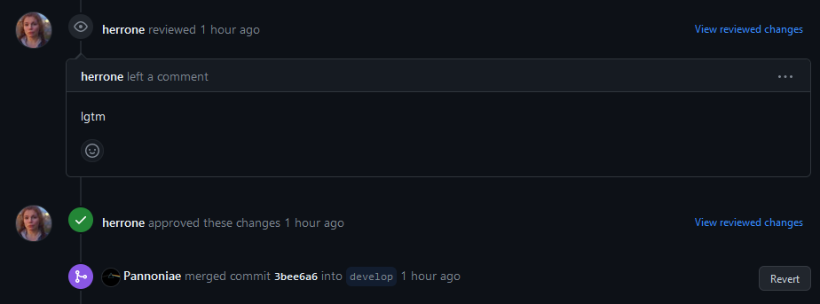

# Workflow

## Task workflow

I have assigned myself task [#9](https://github.com/Software-Engineering-Red/MAUI-APP/issues/9).

I have moved it to `In Progress` as shown in Figure 1.

|  |
|:----------------------------------------:|
|       **Fig.1 - GitHub Projects**        |

I have edited the issue to specify the requirements.

|  |
|:------------------------------------:|
|           **Fig.2 - Task**           |

Then, I have created a branch and I have committed my changes. (Fig. 3 and 4)

|  |
|:--------------------------------------:|
|       **Fig.3 - Branch created**       |

|  |
|:----------------------------------------:|
|           **Fig.4 - Commits**            |

Checking against the Definition of Done, we are done with the task.

 - All acceptance criteria on issue are met (yes)
 - All integration tests/Unit tests are passed and/or written if required (N/A)
 - All review comments have been correctly responded to and addressed if required (yes)
 - Any additional information should be added in comments on the issue itself with as much detail as possible available to the assigned programmer (N/A)

I have created a pull request ([#26](https://github.com/Software-Engineering-Red/MAUI-APP/pull/26)) to get my changes merged to the repository.

|  |
|:------------------------------:|
|    **Fig.5 - Pull Request**    |

It has been reviewed and merged in.

|  |
|:--------------------------------:|
| **Fig.6 - Pull Request review**  |

## Reflection

### MAUI App

The application seems to work and look differently on everyone's machines.
That is certainly interesting, and debugging issues are really complex due to the sandboxed nature of the application.
Forcing it to display in light/dark mode only works partially; there is white-on-white text.

The application does not work on Windows natively, only under Android.
I've only accidentally discovered this and this is very surprising.

### Git and teamwork
There are problems with merging and communication. As not all branches are up-to-date with develop, there are lots of merge conflicts
which are not resolved appropriately.

The Definition of Done is not great as half of the requirementsare optional, and it does not include anything about deploying/merging code.
For this definition, the code does not even need to be merged to be "done".

There are no clear written procedures around creating or updating tasks,
and the project setup is not documented clearly.

The task board itself is good, and the categories are clear.
