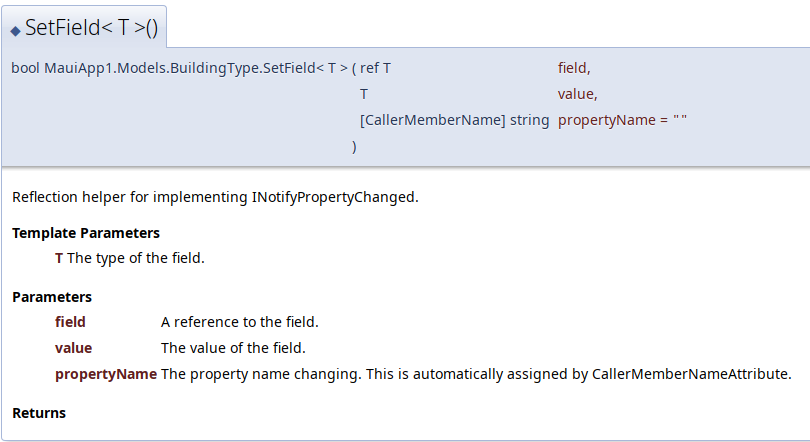

# Documentation

## Clean Code Principles

### Use meaningful names
Names for identifiers should be easily understandable, searchable and unambiguous.
```csharp
BuildingType selectedBuildingType = null;
```

This name is good because it conveys the semantic meaning of the field accurately, not just its type.

### Functions
Functions should be short, do one thing, and operate on one level of abstraction.
```csharp
private async Task LoadBuildingTypes()
{
    buildingTypes = new ObservableCollection<BuildingType>(await buildingTypeService.GetBuildingTypeList());
    ltv_buildingtype.ItemsSource = buildingTypes;
}
```

This function does one thing - it initialises `buildingTypes` and assigns it to a list display.

### Comments
Comments should be explaining "why", not "what". They should be used sparingly, and not for explaining obvious things.

Examples are not given here because the task was not suitable for these kinds of highly sophisticated comments.

### KISS
Keep the implementation simple, without confusing, *brain-hurting* code.
```csharp
private void ltv_buildingtypes_ItemSelected(object sender, SelectedItemChangedEventArgs e)
{
    selectedBuildingType = e.SelectedItem as BuildingType;
    if (selectedBuildingType == null) return;

    txe_buildingtype.Text = selectedBuildingType.Name;
}
```

This code implements KISS because the logic is straightforward. It gets the selected item type,
checks for the type, and if it's correct, updates the textbox's contents.
The method is written in a straightforward way, without any indirection.

### DRY
Don't repeat yourself. Do not copy-paste code with slight modifications.
```csharp
public string Name
{
    get => name;
    set => SetField(ref name, value);
}

protected bool SetField<T>(ref T field, T value, [CallerMemberName] string propertyName = "")
{
    if (EqualityComparer<T>.Default.Equals(field, value)) return false;
    field = value;
    OnPropertyChanged(propertyName);
    return true;
}
```

This code implements DRY because it uses field references to avoid repeating INotifyPropertyChanged boilerplate,
leading to less repetition.

### YAGNI
Don't include useless functionality or dead code which is not used.
Do not overcomplicate "generic" abstractions which are used only for a single implementation.
```csharp
                    .------,
      .\/.          |______|
    _\_}{_/_       _|_Ll___|_
     / }{ \       [__________]          .\/.
      '/\'        /          \        _\_\/_/_
                 ()  o  o    ()        / /\ \
                  \ ~~~   .  /          '/\'
             _\/   \ '...'  /    \/_
              \\   {`------'}    //
               \\  /`---/',`\\  //
                \/'  o  | |\ \`//
                /'      | | \/ /\
   __,. -- ~~ ~|    o   `\|      |~ ~~ -- . __
               |                 |
          jgs  \    o            /
                `._           _.'
                   ^~- . -  ~^
```

Since we do not have dead code or useless functionality, this example is empty.
Here is an ASCII snowman instead.

## Doxygen Documentation

An example of documentation can be found below.
```csharp
/// <summary>
/// Reflection helper for implementing <see cref="INotifyPropertyChanged"/>.
/// </summary>
/// <typeparam name="T">The type of the field.</typeparam>
/// <param name="field">A reference to the field.</param>
/// <param name="value">The value of the field.</param>
/// <param name="propertyName">The property name changing. This is automatically assigned by <see cref="CallerMemberNameAttribute"/>.</param>
/// <returns></returns>
```

Doxygen comments have a main purpose of serving as an accessible documentation
without having to look at the source code itself.
A summary is given for each member, and for methods, each parameter and return value has its own description.
Text can include references to code or other types.

This generates the following Doxygen HTML documentation:



## Self-Descriptive Code

### Example 1
```csharp
public async Task<int> AddBuildingType(BuildingType buildingType)
{
    await SetUpDb();
    return await _dbConnection.InsertAsync(buildingType);
}
```

This function is very short and straightforward - it sets the database connection up and
inserts the building type into the database, so no comments are needed.

### Example 2
```csharp
protected void OnPropertyChanged(string propertyName) => 
    PropertyChanged?.Invoke(this, new PropertyChangedEventArgs(propertyName));
```

This function is standard C# boilerplate for INotifyPropertyChanged, so comments are not necessary.

### Example 3

```csharp
[PrimaryKey, AutoIncrement]
public int ID { get; set; }
```

This code is really descriptive, declaring a primary key for a model.
Attributes declaratively describe what the desired traits for the field are.

